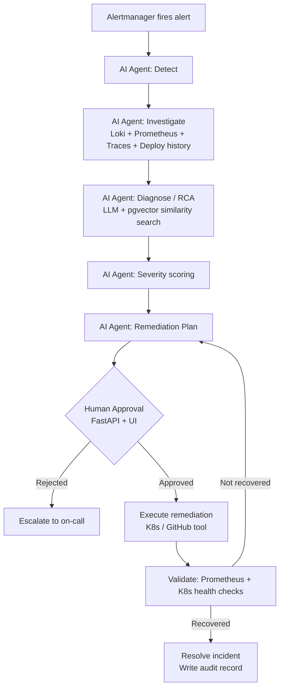
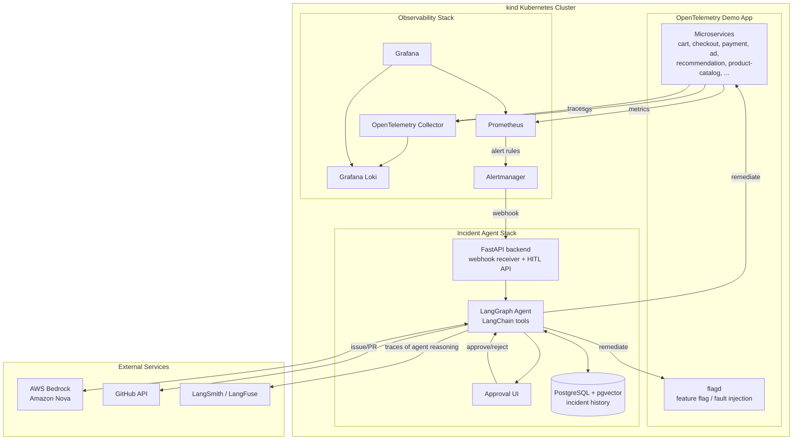

# Autonomous Post-Deployment Incident & Remediation Agent — Architecture & Plan

This document is the single source of truth for what we are building inside this folder.
Nothing outside `incident-remediation-agent/` is modified.

## 1. Goal

Run a real microservices application under observation, deliberately trigger production
incidents, and let an AI agent detect → investigate → diagnose → plan → (human approves) →
remediate → validate → resolve the incident automatically, with full audit trail.

This must also work as a **live company demo**: someone should be able to trigger a fault
on demand and watch, in real time in a UI, every step the agent takes and why — not just
see a final result.

## 2. Target Application Under Observation

- **App**: [OpenTelemetry Demo ("Astronomy Shop")](https://github.com/open-telemetry/opentelemetry-demo)
  — ~15 microservices (cart, checkout, payment, ad, recommendation, product-catalog, etc.)
- Already instrumented end-to-end with OpenTelemetry (traces, metrics, logs).
- Ships with a **flagd** feature-flag service used to toggle built-in faults on/off live.
- Deployed into our own **kind** (Kubernetes-in-Docker) cluster using Kubernetes manifests
  or Helm charts — **no `docker-compose` anywhere in this project**, including the demo
  app's own default compose setup, the observability stack, or the agent/API/UI services.
  Everything is a Kubernetes object from day one so remediation actions act on real K8s
  objects (pods, deployments) and the agent's tools don't need a separate "compose mode".

## 3. Observability Stack

| Signal | Tool | Notes |
|---|---|---|
| Logs | **Grafana Loki** | Demo defaults to OpenSearch — we swap the OTel Collector's log exporter to Loki |
| Metrics | **Prometheus** | Already bundled with the demo |
| Traces | **OpenTelemetry Collector** | Already bundled with the demo |
| Alerting | **Prometheus Alertmanager** | Not in the demo — we add it + our own alert rules |
| Dashboards | **Grafana** | Already bundled; add Loki + Alertmanager datasources |

### Alert rules (initial set)
- High HTTP 5xx error rate per service
- p95/p99 latency above threshold per service
- Pod crash-loop / restart count spike
- Kafka consumer lag spike (checkout/order flow)

## 4. Fault / Incident Scenarios (4–6 total)

Mix of the demo's built-in `flagd` faults and custom faults we script ourselves:

**Built-in (via flagd flag toggle)**
1. `paymentServiceFailure` — payment service returns errors → checkout failures
2. `paymentServiceUnreachable` — payment service times out → latency spike
3. `productCatalogFailure` — product catalog errors → browse/search failures
4. `adServiceHighCpu` — ad service CPU spike → latency/resource pressure

**Custom (scripted by us)**
5. Manual pod kill / crash-loop injection on a chosen deployment (via `kubectl delete pod`
   in a loop, or a sidecar that exits non-zero)
6. Manual replica scale-to-zero or resource-limit throttle to simulate capacity incident

Each scenario maps to: expected alert(s) fired → expected root cause → expected remediation
action, so we can evaluate the agent's accuracy later.

## 5. Extensibility — Adding New Faults Later

Faults are never hardcoded into agent logic. They live in a **fault registry**
(`scripts/faults/registry.yaml`), where each entry defines:

```yaml
- id: paymentServiceFailure
  type: flagd            # flagd | script
  target: flagd-flag-name-or-script-path
  expected_alert: PaymentServiceHighErrorRate
  expected_root_cause: "Payment service returning 5xx"
  expected_remediation: "toggle_flag_off"
```

Adding a new fault later — before or after the company demo — means adding one entry
(and a script if it's custom), nothing else changes. The UI's "Trigger Fault" panel
(see below) reads this registry, so new faults automatically appear as demo buttons
without touching agent or UI code.

## 6. AI Incident Agent

- **Framework**: LangGraph (state machine / graph orchestration) + LangChain (tool calling,
  retrieval)
- **LLM**: AWS Bedrock — **Amazon Nova** model family
- **Historical incident memory**: PostgreSQL + `pgvector`, deployed in-cluster as a
  StatefulSet, storing past incidents + embeddings for similarity search ("has this
  happened before?")
- **Agent graph stages**:
  1. **Detect** — receives Alertmanager webhook
  2. **Investigate** — pulls logs (Loki), metrics (Prometheus), traces (OTel), recent
     deployments/changes
  3. **Diagnose / RCA** — LLM reasons over collected evidence + historical similar incidents
  4. **Severity scoring** — rules + LLM
  5. **Plan** — proposes a remediation action from an allow-listed tool set
  6. **Human approval (HITL)** — FastAPI + UI; plan is blocked until approved or escalated
  7. **Remediate** — executes only the approved action
  8. **Validate** — re-checks metrics/health post-action
  9. **Resolve & audit** — writes full incident record + trace to PostgreSQL (and
     LangSmith/LangFuse for LLM observability)

## 7. Allowed Remediation Actions (tool allow-list)

| Category | Actions |
|---|---|
| Kubernetes | restart pod, scale deployment, rollback deployment to previous revision, toggle a flagd feature flag off |
| GitHub | create an issue documenting the incident + suggested code fix; optionally open a draft PR |

No direct AWS infrastructure actions and no unrestricted shell/API access — every action is
a specific, pre-approved function the agent may call.

## 8. Demo & Live Observability UI (full transparency — required)

This is a hard requirement, not optional polish, since the whole point is demoing this
live at your company. The UI must show **literally every step**, in real time, not just
end results.

### 8.1 Trigger Fault panel
- Buttons (one per fault-registry entry) to inject a failure on demand, live, during the demo.
- Shows current active faults and lets you clear them.

### 8.2 Live Agent Timeline (the centerpiece)
- One row per LangGraph node execution, streamed to the UI in real time via WebSocket/SSE
  as the agent runs (Detect → Investigate → Diagnose → Severity → Plan → Approval →
  Remediate → Validate → Resolve).
- Each row expands to show:
  - Inputs the node received
  - Raw evidence pulled (log lines, metric values, trace spans, deployment diffs)
  - The LLM prompt sent to Bedrock/Nova and the LLM's response/reasoning summary
  - Any tool calls made, their arguments, and their results
  - Timestamp + duration of that step
- This is effectively a live, human-readable rendering of the LangGraph execution trace —
  nothing hidden in a backend log that only a developer could read.

### 8.3 Evidence panel
- Embedded Grafana panels (or lightweight custom charts) showing the live logs/metrics/
  traces the agent is currently looking at, side by side with its reasoning.

### 8.4 Approval panel
- Shows the proposed remediation plan with the LLM's justification, an Approve/Reject
  button, and who approved it + when (audit trail).

### 8.5 History panel
- List of past incidents (from the PostgreSQL/pgvector store) with outcome, and which past
  incidents the agent considered "similar" for the current one (shows the retrieval step
  isn't a black box either).

### 8.6 Outcome panel
- Before/after metric graphs proving the remediation worked, plus the final audit record.

All of the above is one Human Approval / demo UI (not two separate UIs) — a single page
an audience can watch end-to-end during a live walkthrough.

## 9. Human-in-the-Loop Flow



## 10. Full System Architecture



## 11. Planned Folder Structure (to be created as we build)

```
incident-remediation-agent/
├── ARCHITECTURE.md              (this file)
├── app/                         # OpenTelemetry Demo app manifests/config (fork + overrides)
├── observability/               # Loki, Prometheus, Alertmanager, Grafana configs & rules
├── agent/                       # LangGraph + LangChain agent code
│   ├── graph/                   # LangGraph nodes/edges (detect, investigate, diagnose, plan, remediate, validate)
│   ├── tools/                   # Allow-listed remediation tools (k8s, github)
│   └── memory/                  # pgvector historical incident store access layer
├── api/                         # FastAPI backend (webhook receiver, HITL API, WebSocket/SSE stream of agent steps)
├── ui/                          # Live demo UI (trigger fault, agent timeline, evidence, approval, history, outcome)
├── infra/                       # kind cluster config, Helm values, k8s manifests (no docker-compose)
└── scripts/                     # Fault-injection scripts + fault registry, setup/teardown helpers
```

## 12. Open Items (to resolve before/while building)

- Which GitHub repo the agent targets for issue/PR creation.
- Finalize exact custom fault scripts for scenarios 5–6.
- AWS Bedrock region/model access enablement (user-side).
- LangSmith vs LangFuse choice for agent observability.

## 13. Build Order (proposed, not started)

1. Stand up `kind` cluster + deploy OTel Demo app, verify it runs.
2. Swap log backend to Loki; verify logs flow into Grafana.
3. Add Alertmanager + alert rules; verify alerts fire when faults are toggled via flagd.
4. Stand up PostgreSQL + pgvector in-cluster.
5. Build FastAPI webhook receiver + WebSocket/SSE stream + fault registry endpoints.
6. Build LangGraph agent graph with investigate/diagnose/plan nodes (read-only tools first),
   emitting a step event for every node so the UI has something to render immediately.
7. Build the live demo UI (trigger fault, agent timeline, evidence, approval, history, outcome).
8. Wire AWS Bedrock (Amazon Nova) as the LLM backend.
9. Add remediation tools (K8s actions, GitHub actions) gated behind approval.
10. Add validation + resolution + audit persistence.
11. End-to-end test against all 4–6 fault scenarios, then rehearse the live demo flow.

---
**Status: planning only, no code written yet.**
