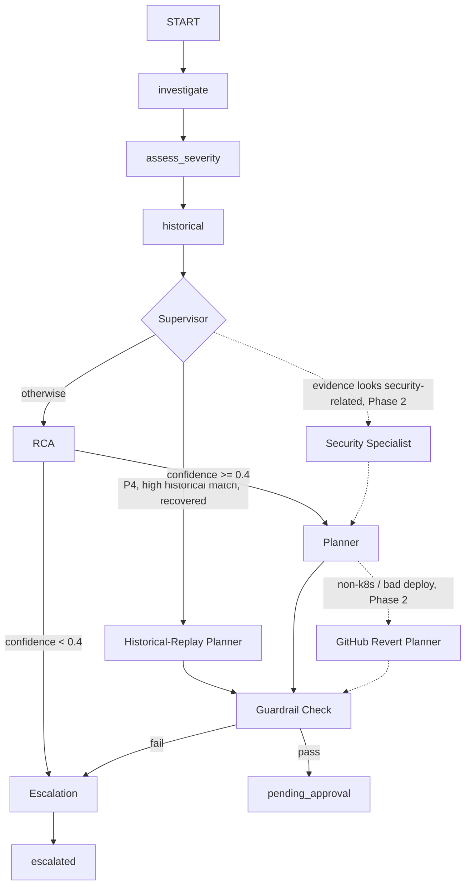

# Agents & Tools — Architecture Guide

This document describes the incident-response agent system: the multi-agent
handoff pipeline that exists today (per `docs/BUILD_PLAN.md`/`docs/SRS.md`,
upgraded with the supervisor/guardrail routing described below), and a
remaining set of **Phase 2 proposals** (security specialist, GitHub planner)
that still need their supporting tools built before they're stubbed in.
Anything under "Proposed" is a design, not yet implemented — treat it as the
target for the next iteration, not current behavior.

## 1. Current architecture (implemented)

```
START -> investigate -> assess_severity -> historical -> supervisor
supervisor -> auto_plan (P4, high-confidence recovered historical match)
supervisor -> rca       (everything else)
rca -> escalate (low_confidence) | plan (otherwise)
auto_plan / plan -> guardrail -> escalate | END
escalate -> END
                                                                    │
                                                        (human approval gate)
                                                                    │
                                              remediate (k8s_tool) -> validate
```

Routing lives in [agent/graph.py](agent/graph.py): a P4 incident with a
high-similarity historical match that actually recovered skips straight to
`auto_plan`, replaying that incident's plan instead of re-running RCA+Plan
LLM calls; a low-confidence RCA hands off to `escalate` instead of letting
Plan invent an unfounded remediation; and a deterministic `guardrail` node
sanity-checks every plan (action count, namespace) before it's ever shown to
a human. Remediation/validation still live outside the graph in
[api/pipeline.py](api/pipeline.py), gated by
[api/routers/approvals.py](api/routers/approvals.py). Every node's output is
still logged via `repo.log_audit_event`, including which route the
supervisor/rca/guardrail nodes took.

## 2. Why move to multi-agent handoff

Reviewing comparable systems (e.g. agenticsorg/devops' orchestrator +
specialist-agent handoff model) surfaced three gaps a fixed pipeline can't
close:

- **No routing** — a trivial P4 log-noise alert ran the same RCA+Plan LLM
  calls as a P1 outage. *(Closed — `supervisor` + `auto_plan`.)*
- **No specialization** — Kubernetes, and eventual AWS/GitHub remediation
  targets (SRS §10.C, Phase 2), would all be forced through one generic
  `plan` node and prompt. *(Still open — see `gh_planner`/`security` below;
  blocked on Phase 2 tooling.)*
- **No deterministic pre-approval check** — the allow-list filter in
  `agent/nodes/plan.py` only checks the action *name*; it doesn't sanity
  check the whole plan (target namespace, action count, params) before a
  human sees it. *(Closed — `guardrail`.)*

## 3. Multi-agent handoff architecture



Dotted edges are still **Proposed** (Phase 2, no supporting tools yet).
Implementation note: this is a **routing pattern inside one LangGraph graph**,
not separate processes — every node is an ordinary async function;
`supervisor`, `rca`, and `guardrail` use `StateGraph.add_conditional_edges`
with a plain router function (`route_after_supervisor`, `route_after_rca`,
`route_after_guardrail`) instead of a fixed `add_edge`. State (`AgentState`)
is the handoff payload; no new transport is introduced — see
[agent/graph.py](agent/graph.py).

### 3.1 Agent directory — work and source

Each entry below is one LangGraph node (= one agent). "Source" is where it's
implemented today, or where it would live once built (Proposed).

**`investigate`** — *implemented, unchanged*
Pulls Loki error lines, Prometheus error-rate/p95 latency, and the currently
deployed image tag for `service_name`; records a pre-incident `baseline` so
`validate` can later prove a measurable improvement rather than just checking
an absolute threshold. No LLM call — pure tool calls.
Source: [agent/nodes/investigate.py](agent/nodes/investigate.py) using
[tools/loki_tool.py](tools/loki_tool.py), [tools/prometheus_tool.py](tools/prometheus_tool.py),
[tools/k8s_tool.py](tools/k8s_tool.py) (`get_deployment_image_tag`, read-only).

**`assess_severity`** — *implemented, unchanged*
Blends rule thresholds with an LLM judgment to assign P1–P4; always returns a
one-line rationale, and falls back to the rule-based value alone if the LLM
call fails.
Source: [agent/nodes/severity.py](agent/nodes/severity.py), rules in
[agent/heuristics.py](agent/heuristics.py), prompt in
[agent/prompts/severity_v1.txt](agent/prompts/severity_v1.txt).

**`historical`** — *implemented, unchanged*
Scores past resolved incidents (fetched by `api/pipeline.py` from Postgres,
never by `agent/` itself — NFR-14) by title/service/severity overlap. Purely
heuristic; no embeddings/pgvector (that's Phase 2, SRS §10.C).
Source: [agent/nodes/historical.py](agent/nodes/historical.py), scoring in
[agent/heuristics.py](agent/heuristics.py).

**`rca`** — *implemented, unchanged*
LLM-generated root-cause summary plus a 0–1 confidence score; flags
`low_confidence` below 0.4 so the human approver sees the agent is unsure,
instead of a confidently-wrong guess.
Source: [agent/nodes/rca.py](agent/nodes/rca.py), prompt in
[agent/prompts/rca_v1.txt](agent/prompts/rca_v1.txt).

**`plan`** (today's single, generic planner) — *implemented, unchanged*
LLM proposes remediation actions; anything not in `tools/allowlist.yaml` is
dropped before a human ever sees it, and if nothing survives that filter it
falls back to a deterministic rule-based plan instead of returning nothing.
Source: [agent/nodes/plan.py](agent/nodes/plan.py), fallback in
[agent/heuristics.py](agent/heuristics.py) (`rule_based_plan`), catalog in
[tools/allowlist.yaml](tools/allowlist.yaml).

**`supervisor`** — *implemented*
Pure rule-based router (no LLM) reading `severity` + `similar_incidents` off
state via `find_auto_plan_candidate`; routes to `auto_plan` only for a P4
incident with a high-similarity (>= 0.7) historical match that actually
recovered (`validation_result.recovered`), otherwise routes to `rca`.
Deterministic so it's unit-tested without mocking an LLM (see
[tests/agent/test_supervisor_guardrail.py](tests/agent/test_supervisor_guardrail.py)).
Source: [agent/nodes/supervisor.py](agent/nodes/supervisor.py).

**`auto_plan`** — *implemented*
Shortcut that skips `rca`+`plan` entirely: copies the remediation plan from
the matched historical incident found by `supervisor` instead of asking the
LLM to reinvent it.
Source: [agent/nodes/auto_plan.py](agent/nodes/auto_plan.py).

**`guardrail`** — *implemented*
Deterministic Python check (no LLM) run on whatever plan comes out of
`auto_plan` or `plan` — action count, namespace sanity — before it's
persisted as `pending_approval`. Hardens, rather than replaces, the
per-action allow-list filter already inside `plan.py`.
Source: [agent/guardrail.py](agent/guardrail.py) (the check itself),
[agent/nodes/guardrail.py](agent/nodes/guardrail.py) (the node) — see §4.

**`escalate`** — *implemented*
Terminal node for anything the pipeline can't confidently propose a fix for
(low RCA confidence via `rca`'s `escalation_reason`, or a guardrail
rejection). `api/pipeline.py` persists `status=escalated` off the state's
`escalation_reason` instead of `pending_approval` — no remediation plan is
shown to a human, no auto-remediation is implied.
Source: [agent/nodes/escalate.py](agent/nodes/escalate.py).

---

**`security`** — *Proposed specialist*
Handles evidence the supervisor flags as security-related (e.g. unexpected
`kubectl exec`, RBAC/NetworkPolicy changes in logs). Uses a narrower prompt
that is only allowed to reason about containment, never scaling/rollback.
Source (proposed): `agent/nodes/security.py`, prompt
`agent/prompts/security_v1.txt` (not yet written).

**`planner_route`** — *Proposed*
Router between planner specialists based on the remediation target inferred
from `evidence`/`service_name` metadata (k8s workload vs. non-k8s service).
Not needed while `tools/allowlist.yaml` only has `kubernetes` rows — every
plan already targets k8s, so there is nothing to route between yet.
Source (proposed): `agent/nodes/planner_route.py`.

**`k8s_planner`** — *Proposed rename/scope of today's `plan`*
Same LLM+fallback behavior as today's `plan` node, just scoped to
`tools/allowlist.yaml` rows where `target: kubernetes` — no behavior change,
only a rename to make room for sibling planners. Deferred until `gh_planner`
(or another target) actually exists, per the migration note in §6.
Source (proposed): `agent/nodes/k8s_planner.py` (moved from `plan.py`).

**`gh_planner`** — *Proposed, Phase 2*
For services with no k8s rollback path: proposes a single `open_revert_pr`
action instead of an infra change. Needs `github` rows added to the allow-list
and a `github_tool` module first (§5) — don't stub this node before those exist.
Source (proposed): `agent/nodes/gh_planner.py`, `tools/github_tool.py`.

### 3.2 Handoff quick reference

| Agent | Hands off to |
|---|---|
| `investigate` | `assess_severity` |
| `assess_severity` | `historical` |
| `historical` | `supervisor` |
| `supervisor` | `auto_plan`, `rca` (or `security`, proposed) |
| `auto_plan` | `guardrail` |
| `rca` | `plan`, or `escalate` if `low_confidence` |
| `security` (proposed) | `plan` (via `planner_route`, proposed) |
| `plan` / `gh_planner` (proposed) | `guardrail` |
| `guardrail` | `pending_approval` (`END`) or `escalate` |
| `escalate` | `END` |

Everything from **human approval onward is unchanged**: `guardrail` passing
does not grant execution — it only means the plan is fit to *show* a human.
`api/routers/approvals.py` remains the only path that can trigger
`tools/k8s_tool.py` writes (FR-12..15). This preserves the project's
existing HITL guarantee; multi-agent handoff only changes how the *proposal*
is produced, never who is allowed to execute it.

## 4. Guardrail: deterministic, not an LLM call

Unlike agenticsorg/devops' string-matching LLM guardrails, this one stays
pure Python — the whole point is a check that doesn't depend on model
behavior ([agent/guardrail.py](agent/guardrail.py)):

```python
def check_plan(plan: list[dict], *, allowed_namespace: str, max_actions: int = 3) -> str | None:
    """Returns None if the plan is safe to show a human, else an escalation reason."""
    if not plan or len(plan) > max_actions:
        return f"plan has {len(plan)} actions, expected 1-{max_actions}"
    for action in plan:
        if action.get("params", {}).get("namespace", allowed_namespace) != allowed_namespace:
            return f"action targets namespace outside {allowed_namespace}"
    return None
```

This runs as the last node before `pending_approval`/`END`, after the
existing per-action allow-list filter in `plan.py` — defense in depth, same
spirit as FR-11/FR-15 ("don't trust the previous layer's filtering alone").
When it rejects a plan, `agent/nodes/guardrail.py` sets `escalation_reason`
on the state and `route_after_guardrail` sends the graph to `escalate`
instead of `END`; `api/pipeline.py` persists that reason to the incident's
`escalation_reason` column (`db/migrations/0002_add_escalation_reason.sql`)
so it's visible in the UI instead of only in the audit log.

## 5. Tools catalog

### Implemented today

| Tool | Module | Kind | Used by | Notes |
|---|---|---|---|---|
| `loki_tool` | [tools/loki_tool.py](tools/loki_tool.py) | read-only | `investigate` | error-line search scoped to `service_name` |
| `prometheus_tool` | [tools/prometheus_tool.py](tools/prometheus_tool.py) | read-only | `investigate` | error rate, p95 latency |
| `k8s_tool` | [tools/k8s_tool.py](tools/k8s_tool.py) | write, allow-listed | executor (post-approval) | `restart_pod`, `rollback_deployment`, `scale_deployment`; re-validates against `tools/allowlist.yaml` itself (FR-15), supports `dry_run` (FR-17) |
| `get_deployment_image_tag` | `tools/k8s_tool.py` | read-only | `investigate` | not on the allow-list — never mutates |

### Proposed additions (support the new specialists above)

| Tool | Target | Used by | Purpose |
|---|---|---|---|
| `github_tool.open_revert_pr` | `github` | `gh_planner` (post-approval executor) | for services without a k8s rollback path — opens a PR reverting the last merge to the deployed branch instead of touching infra directly |
| `github_tool.create_issue` | `github` | escalation / incident close-out | files a Markdown incident report (evidence + RCA + outcome) — same idea as agenticsorg's `generate_security_report`, adapted to close the loop on `escalated`/`resolved` incidents |
| `notifier_tool` | n/a | `escalate` | pages a human (Slack/webhook) — today `escalated` only changes DB status with no outbound notification, which is a real gap once auto-remediation stops being the default path |

Extending `tools/allowlist.yaml` for Phase 2 targets should follow the same
shape as today's entries (`target`, `name`, `risk`, `approval_required`) —
each specialist planner only loads the subset matching its own `target`, so
adding `github`/`aws` rows doesn't widen what `k8s_planner` can propose.

## 6. Migration path

1. ~~Land `agent/guardrail.py` and wire it as the final node before `END`~~ —
   **done**: `agent/guardrail.py` + `agent/nodes/guardrail.py`, routing via
   `route_after_guardrail`.
2. ~~Introduce `supervisor` with a single route (P4 + historical-match ->
   `auto_plan`, everything else -> `rca`->`plan`)~~ — **done**:
   `agent/nodes/supervisor.py` + `agent/nodes/auto_plan.py`, using
   `StateGraph.add_conditional_edges` rather than `Command` (simpler, stable
   in the pinned `langgraph==0.2.45`, same handoff semantics).
3. Add `security` and `gh_planner` only once Phase 2 tooling
   (`github_tool`, AWS allow-list rows) actually exists — don't stub routes
   to specialists with no tools behind them. `planner_route` and the
   `plan` -> `k8s_planner` rename are deferred alongside this, since there's
   still only one planning target (`kubernetes`) to route to.
4. Keep `agent/` free of `db`/`api` imports throughout (NFR-14) — routing
   decisions must be derivable from `AgentState` alone, same constraint as
   every existing node. (`agent/nodes/guardrail.py` only reads `APP_NAMESPACE`
   from the environment, same pattern as `api/pipeline.py`'s own default —
   not a `db`/`api` import.)
