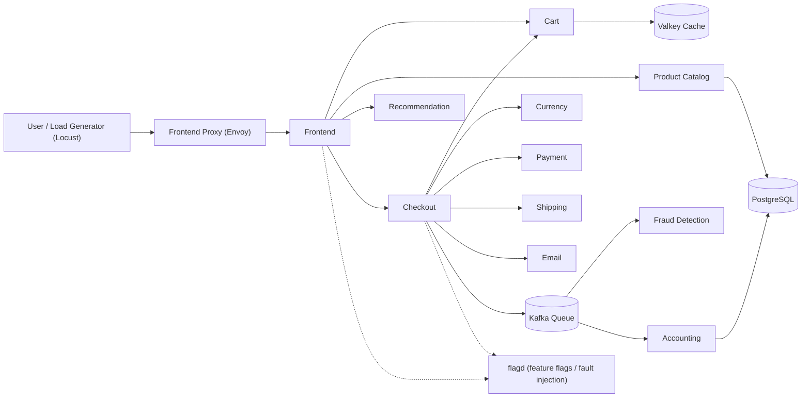
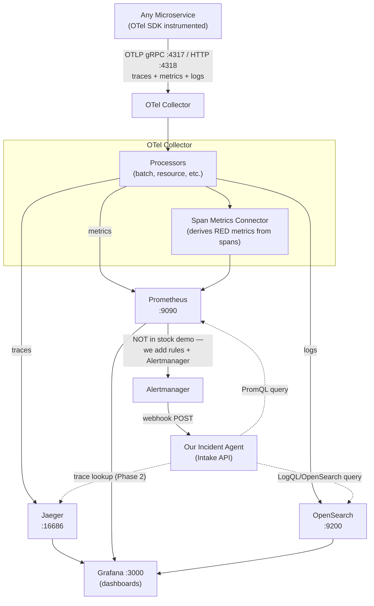

# Data Flow Diagram — Monitored Application (OpenTelemetry Demo)

> Monitored application decision (resolves SRS §10.B open question #1): **[open-telemetry/opentelemetry-demo](https://github.com/open-telemetry/opentelemetry-demo)** ("OpenTelemetry Astronomy Shop") — a polyglot microservice e-commerce demo built specifically to showcase logs, metrics, and traces. Companion to [SRS.md](./SRS.md).

---

## 1. What the app is

- ~20 microservices (frontend, cart, checkout, payment, currency, shipping, email, product-catalog, recommendation, ad, quote, fraud-detection, accounting, flagd feature-flag service, load-generator, image-provider, Kafka queue, Postgres) written in 10+ languages, talking over gRPC/HTTP/Kafka.
- Ships with its own observability stack: **OTel Collector → Jaeger (traces) + Prometheus (metrics) + OpenSearch (logs) → Grafana (dashboards)**.
- Fault injection is built in via **flagd** feature flags (e.g. force product-catalog failure, ad-service high latency, payment failure) — no custom chaos scripts needed.

## 2. Business data flow (simplified — core checkout path only)



Simplified on purpose — every service also calls `flagd` for flag checks; only the checkout/order path is shown since that's the scenario used in the demo script (BUILD_PLAN §8).

## 3. Telemetry data flow (what the Agent will actually query)



### What logs look like
- Structured JSON logs, emitted via the OpenTelemetry Logs SDK/appenders in each language.
- Auto-correlated with `trace_id` / `span_id` of the request that produced them — so a log line can be pivoted straight to its trace.
- Coverage varies by service (not all 20 services emit logs yet — see the project's own [log coverage page](https://opentelemetry.io/docs/demo/telemetry-features/log-coverage/)).

### What traces look like
- End-to-end distributed spans across gRPC/HTTP calls and Kafka produce/consume steps (e.g. one order checkout can span Frontend → Checkout → Payment/Shipping/Email → Kafka → Fraud Detection/Accounting).
- Span attributes include business context (product IDs, cart contents, currency, feature-flag evaluation results), useful as RCA evidence, not just latency numbers.
- Prometheus metrics include both SDK-reported metrics and Collector-derived "span metrics" (request rate/error rate/duration per service) — good fit for our Severity node's RED-metric checks.

## 4. OpenTelemetry signal data models (per [opentelemetry.io/docs](https://opentelemetry.io/docs/))

Each signal has a defined schema. This is what our Investigate/Severity/RCA nodes actually parse — not free-text.

### 4.1 Logs — Log Record fields

| Field | Meaning | Used by Agent for |
|---|---|---|
| `Timestamp` / `ObservedTimestamp` | When the event happened / was observed | Windowing around the alert time |
| `TraceId`, `SpanId`, `TraceFlags` | Links this log line to the exact trace/span that produced it | Pivot log→trace for RCA evidence |
| `SeverityText` / `SeverityNumber` | Log level (e.g. `ERROR`=17) | Filter to error/warn lines only |
| `Body` | The log message | RCA prompt evidence (quoted, per NFR-4) |
| `Resource` | Source service/pod/container | Identify affected `service_name` |
| `Attributes` | Arbitrary key/value context | Extra evidence (e.g. `http.status_code`) |

Example structured log record (checkout-service style):
```json
{
  "timestamp": "2026-09-24T12:34:56.789Z",
  "severityText": "ERROR",
  "severityNumber": 17,
  "body": "Payment charge failed for order",
  "traceId": "7bba9f33312b3dbb8b2c2c62bb7abe2d",
  "spanId": "086e83747d0e381e",
  "resource": { "service.name": "checkout", "service.version": "1.0.0" },
  "attributes": { "order.id": "abc-123", "error.type": "PaymentServiceUnavailable" }
}
```

### 4.2 Traces — Span fields

| Field | Meaning | Used by Agent for |
|---|---|---|
| `name`, `kind` | Operation name; Client/Server/Producer/Consumer | Identify the failing hop (e.g. Checkout→Payment `Client` span) |
| `context.trace_id` / `span_id` | Correlation IDs | Group all spans/logs of one failing request |
| `parent_id` | Builds the call hierarchy | Reconstruct "path of the request" for RCA |
| `start_time` / `end_time` | Duration | Latency evidence for Severity node |
| `status_code` (`OK`/`ERROR`/`UNSET`) | Whether the operation failed | Primary signal for "which service actually errored" |
| `attributes` | Business + semantic-convention metadata | RCA evidence (e.g. `rpc.service`, `order.id`) |
| `events` | Timestamped sub-events within the span | Fine-grained error detail (e.g. exception stack trace event) |

Example span (Checkout → Payment call, matching §2's business flow):
```json
{
  "name": "grpc.oteldemo.PaymentService/Charge",
  "context": { "trace_id": "7bba9f33312b3dbb8b2c2c62bb7abe2d", "span_id": "51e1abe1c293564f" },
  "parent_id": "086e83747d0e381e",
  "kind": "CLIENT",
  "start_time": "2026-09-24T12:34:56.700Z",
  "end_time": "2026-09-24T12:34:56.900Z",
  "status_code": "ERROR",
  "status_message": "payment service unavailable",
  "attributes": { "rpc.service": "oteldemo.PaymentService", "order.id": "abc-123" }
}
```

### 4.3 Metrics — instrument kinds actually queried

| Instrument | Example in this app | Used by Agent for |
|---|---|---|
| Counter | `http.server.request.count`, error count | Error-rate alert rules (FR-1) |
| Histogram | `http.server.request.duration` | Latency SLO breach detection, p95/p99 checks |
| UpDownCounter / Gauge | Kafka queue length, active requests | Saturation/backlog signals |
| Span-metrics-derived (Collector connector) | Per-service request rate/error rate/duration ("RED") | Cheap Severity-node signal without querying Jaeger directly |

Metrics arrive at Prometheus already aggregated (OTLP data points, not raw events) — the Agent uses PromQL, same as SRS §4.2 already assumes.

### 4.4 Why this matters for the DFD
The `trace_id` is the thread that ties all three signals together end-to-end:
**Alert (service+time window) → Prometheus metric breach → matching error spans in Jaeger (`status_code=ERROR`) → correlated log `Body` for the same `trace_id` in OpenSearch → RCA evidence bundle.** This is the exact query order the Investigate node should follow, and it only works because logs/traces/metrics share the same Resource (`service.name`) and correlation IDs by construction.

## 5. Assumptions

- **A1**: We run the demo via Docker Compose with the full observability profile (Jaeger + Prometheus + OpenSearch + Grafana), not the bare-bones profile.
- **A2**: **Alertmanager is not part of the stock demo stack.** We add it ourselves, pointed at the demo's existing Prometheus, with our own crash-loop/error-rate/latency rules (SRS FR-1). Confirmed as an explicit Phase 0 infra task — see BUILD_PLAN §5 Phase 0 and TASKS §1.
- **A3**: **Logs land in OpenSearch, not Loki, for this specific monitored app.** SRS/BUILD_PLAN/TASKS/readme.md keep "Grafana Loki" as the generic architecture reference and are **intentionally left unchanged** — this DFD is the one place documenting that the OpenTelemetry demo's actual log sink is OpenSearch, and the Investigate node queries OpenSearch (not Loki) whenever this app is the monitored target.
- **A4**: Prometheus metrics match the SRS assumption exactly — no change needed there.
- **A5**: Traces (Jaeger) are already produced for free by this app (fully instrumented out of the box) but **traces stay Phase 2, confirmed** — not pulled into MVP. The Investigate node uses only logs (OpenSearch) + metrics (Prometheus) for now; Jaeger remains available as a manual RCA aid only, not queried by the Agent.
- **A6**: Incident scenarios will be triggered via **flagd** fault-injection flags (e.g. `productCatalogFailure`, `adHighCpu`, `paymentFailure`, `kafkaQueueProblems`) rather than custom chaos scripts, and will target the checkout path shown in §2.
- **A7**: Only the checkout/order path (§2) is instrumented into our demo scenario, not all ~20 services — keeps the MVP scenario simple per BUILD_PLAN's cut-scope order.
- **A8**: We do not change the Collector's own pipeline config beyond adding Alertmanager scrape/rules — Jaeger/Prometheus/OpenSearch stay the default exporters.

## 6. Resolved follow-ups (confirmed 2026-09-24)

1. **Loki vs OpenSearch**: DFD-only deviation. SRS/BUILD_PLAN/TASKS/readme.md keep "Loki" as the generic reference and are not edited; OpenSearch is documented here as the actual sink for this specific monitored app (A3).
2. **Traces into MVP**: Declined. Traces stay Phase 2 per SRS §10.C (A5). The metric→trace→log correlation order in §4.4 is retained as background/Phase-2 reference material only, not applied to SRS FR-4/FR-9.
3. **Alertmanager as Phase 0 task**: Confirmed. Added to BUILD_PLAN §5 Phase 0 and TASKS §1 as an explicit setup step, since the demo app doesn't ship one (A2).
