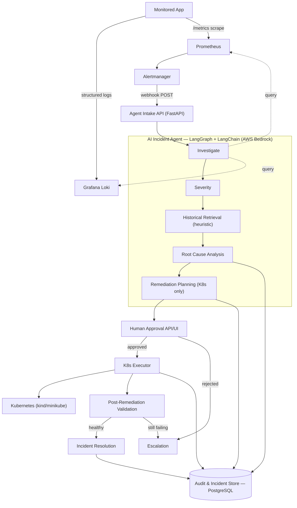

# Software Requirements Specification (SRS)

## Autonomous Post-Deployment Incident & Remediation Agent

| | |
|---|---|
| **Version** | 1.0 (Simplified MVP scope) |
| **Date** | 2026-09-24 |
| **Source** | `readme.md` |
| **Context** | Hackathon build, ~24–48 hours, team of 2 |
| **LLM Provider** | AWS Bedrock |
| **Remediation Target (MVP)** | Kubernetes only (local `kind`/`minikube`). AWS + GitHub are Phase 2 — see §10.C. |

---

## Table of Contents
1. Introduction
2. Overall Description
3. System Features (Functional Requirements — MVP)
4. External Interface Requirements
5. Non-Functional Requirements (MVP)
6. Data Requirements
7. Tool Allow-list (MVP)
8. Key Use Cases
9. Risks
10. Appendices (incl. Phase 2 — Good to Have)

---

## 1. Introduction

### 1.1 Purpose
This document defines the lean MVP the hackathon team is building **right now**: a working version of the loop described in `readme.md`:

```
Detect → Investigate → Diagnose → Plan → Approve → Remediate → Validate → Resolve
```

It is the baseline for `BUILD_PLAN.md` and `TASKS.md`. Anything not needed to prove that loop end-to-end is deferred to §10.C (Phase 2) rather than built now.

### 1.2 Document Conventions
- Requirement IDs: `FR-<n>` (functional), `NFR-<n>` (non-functional).
- Everything in §3/§5 is **MUST** for the demo. Deferred items live only in §10.C — do not start them before the MVP works end-to-end.
- "the Agent" = the AI Incident Agent (LangGraph + LangChain orchestrator). "the System" = the Agent plus the intake/approval API, database, UI, and observability stack.

### 1.3 Intended Audience
Hackathon build team and reviewers.

### 1.4 Project Scope
**In scope (MVP):**
- Ingesting logs and metrics from one monitored application.
- Detecting incidents via Prometheus Alertmanager.
- Investigating context, classifying severity, and retrieving similar historical incidents (heuristic scoring).
- LLM-based Root Cause Analysis (RCA) on Bedrock.
- Generating a Kubernetes-only remediation plan and requesting human approval (HITL).
- Executing approved remediation against a local `kind`/`minikube` cluster.
- Validating recovery and closing (or escalating) the incident.
- A complete, append-only audit trail of every decision and action.

**Deferred to Phase 2 (§10.C)** — not built until the MVP loop works: AWS/GitHub remediation, OpenTelemetry traces, pgvector semantic search, LangSmith/LangFuse tracing, RBAC roles, auto-approval, multi-incident concurrency hardening, notifications.

### 1.5 Definitions, Acronyms, Abbreviations

| Term | Meaning |
|---|---|
| RCA | Root Cause Analysis |
| HITL | Human-in-the-Loop |
| RAG | Retrieval-Augmented Generation |
| kind | "Kubernetes IN Docker" — local K8s cluster for dev/test |
| Alertmanager | Prometheus component that routes/deduplicates firing alerts |
| LangGraph | Stateful graph orchestration framework for LLM agents (LangChain ecosystem) |
| Bedrock | AWS managed service exposing foundation models (e.g., Anthropic Claude) via API |

### 1.6 References
- `readme.md` — original project brief and architecture (authoritative source for this SRS).
- `DFD.md` — data flow + telemetry pipeline for the confirmed monitored application (resolves open question B.1 below).
- LangGraph/LangChain, AWS Bedrock, Prometheus/Alertmanager/Loki documentation.

---

## 2. Overall Description

### 2.1 Product Perspective
The System sits alongside the monitored application and closes the loop from alert to validated resolution:



### 2.2 Product Functions (Summary)
1. Collect and correlate logs and metrics for any firing alert.
2. Classify incident severity using rules + LLM judgment.
3. Retrieve similar past incidents via heuristic scoring to inform diagnosis.
4. Produce a root cause hypothesis with a confidence score and supporting evidence.
5. Produce a concrete, Kubernetes-scoped remediation plan.
6. Require explicit human approval before any state-changing action.
7. Execute approved actions only through an authorized tool allow-list.
8. Validate that the incident is actually resolved before closing it.
9. Persist a complete, queryable audit trail of every decision and action.

### 2.3 User Classes

| User Class | Key Needs |
|---|---|
| On-Call SRE / Approver | Fast, explainable, trustworthy plan review |
| AI Incident Agent | Constrained tool access, clear state machine, deterministic guardrails |

### 2.4 Operating Environment

| Component | Technology | Runs As (Hackathon) |
|---|---|---|
| Monitored application | Existing app (provided) | Container(s) on Kubernetes (`kind`/`minikube`) |
| Log aggregation | Grafana Loki + Promtail | Docker Compose |
| Metrics + alerting | Prometheus + Alertmanager | Docker Compose |
| Agent orchestration | LangGraph + LangChain | Python service |
| LLM | AWS Bedrock (Claude 3.x) | AWS-managed, called over HTTPS |
| Incident + audit store | PostgreSQL | Docker container |
| HITL intake/approval API | FastAPI | Docker container / local process |
| Approval UI | Streamlit (or plain HTML) | Docker container / local process |
| Remediation target | Kubernetes (`kind`/`minikube`) | Local cluster |

### 2.5 Design and Implementation Constraints
- **C-1**: HITL approval is mandatory for every remediation action — no silent autonomous execution.
- **C-2**: The LLM never receives direct credentials or shell access; all actions are mediated through a fixed tool allow-list (§7).
- **C-3**: LLM provider is fixed to **AWS Bedrock**.
- **C-4**: Remediation targets a **local Kubernetes cluster** (`kind`/`minikube`), not a shared production cluster.
- **C-5**: Time-box of 24–48 hours with a 2-person team — see cut-scope order in `BUILD_PLAN.md` §7.

### 2.6 Assumptions
- **A-1**: The monitored application can expose a Prometheus `/metrics` endpoint and structured logs. Missing instrumentation is a Phase 0 task.
- **A-2**: AWS Bedrock model access is enabled with credentials available to the Agent process.
- **A-3**: `kind`/`minikube`, Docker, and `kubectl` are installed on build machines.

---

## 3. System Features (Functional Requirements — MVP)

### 3.1 Detection
- FR-1: Alertmanager rules cover crash-loop pods, elevated error rate, latency SLO breach.
- FR-2: The Alertmanager webhook creates an Incident row in the Intake API within 5 seconds.
- FR-3: Repeated alerts for the same open incident are correlated by Alertmanager's own `fingerprint` field, not a newly invented one.

### 3.2 Investigation
- FR-4: The Investigate node pulls Loki logs and Prometheus metrics for the affected service/time window.
- FR-5: The Investigate node fetches the last deployed image tag/commit for the affected service.
- FR-6: Gathered context is saved to the incident record before the next node runs.

### 3.3 Severity & Root Cause
- FR-7: Severity (P1–P4) comes from simple rule thresholds blended with LLM judgment, with a one-line rationale.
- FR-8: Historical retrieval scores past resolved incidents by title/service/severity overlap (no embeddings needed) and passes the top matches into RCA.
- FR-9: The RCA node (Bedrock) produces a root cause summary, evidence references, and a confidence score (0–1). Confidence below threshold is flagged "low confidence" for the approver.

### 3.4 Planning
- FR-10: The Planning node proposes actions only from the Tool Allow-list (§7).
- FR-11: The Planning node's output is parsed defensively (handles JSON in prose/markdown fences) and any action not on the allow-list is dropped before it reaches a human.

### 3.5 Approval (HITL)
- FR-12: Every plan is shown to a human with RCA rationale, evidence, and risk level before execution.
- FR-13: Approve/reject records who and when, plus an optional comment.
- FR-14: A rejected plan escalates the incident; the Agent does not retry the same plan automatically.

### 3.6 Remediation Execution
- FR-15: The Executor only runs actions from the allow-list — it re-checks this itself and does not trust the Planning node's filtering alone.
- FR-16: Every execution attempt is logged (action, params, start/end time, result).
- FR-17: A dry-run mode exists for rehearsing without applying changes.
- FR-18: K8s actions run only against the configured `kind`/`minikube` context (never inferred).

### 3.7 Validation & Resolution
- FR-19: After execution, poll Prometheus + pod readiness for a bounded window (default 3 min / 15s interval).
- FR-20: Recovered → mark "resolved". Still unhealthy at window end → mark "escalated" (never retry silently forever).
- FR-21: Resolved incidents are added to the historical store used by FR-8.

### 3.8 Audit Trail
- FR-22: Every LLM call, tool call, state transition, and human decision is written to an append-only audit log in Postgres, correlated by `incident_id`.
- FR-23: An API/UI view can reconstruct the full timeline for one incident.

---

## 4. External Interface Requirements

### 4.1 User Interfaces
- **Incident/Approval Dashboard**: incident list by status/severity; detail view with evidence, RCA, historical matches, plan, Approve/Reject.
- **Audit Log Viewer**: chronological timeline of all actions for a given incident.

### 4.2 Software Interfaces

| System | Protocol | Purpose |
|---|---|---|
| Grafana Loki | HTTP/LogQL | Log retrieval for Investigate node |
| Prometheus | HTTP/PromQL | Metric retrieval for Investigate/Validation |
| Prometheus Alertmanager | Webhook (HTTP POST) | Incident detection trigger |
| PostgreSQL | SQL / libpq | Incident store + audit trail |
| AWS Bedrock | HTTPS (AWS SDK) | LLM inference for severity/RCA/planning |
| Kubernetes API | REST (kubeconfig) | Remediation execution (restart/rollback/scale) |

Phase 2 additions (§10.C): OpenTelemetry Collector, `pgvector`, AWS SDK/LocalStack, GitHub REST API, LangSmith/LangFuse.

### 4.3 Communication Interfaces
- All internal services communicate over REST/HTTPS (HTTP acceptable within the local dev/cluster network only).
- Alertmanager → Agent Intake uses an authenticated webhook.

---

## 5. Non-Functional Requirements (MVP)

| ID | Requirement |
|---|---|
| NFR-1 | All remediation actions MUST execute only through the predefined tool allow-list (§7); the LLM MUST NOT have direct shell, kubeconfig, or cloud credential access. |
| NFR-2 | Every state-changing action MUST require explicit, recorded human approval before execution; no silent autonomous execution. |
| NFR-3 | Secrets (Bedrock credentials, kubeconfig) MUST come from environment variables — never committed to source control or logged in plaintext. |
| NFR-4 | Log/alert content is untrusted input: prompts built from it MUST be clearly delimited so embedded instructions can't alter tool selection or bypass approval. |
| NFR-5 | All remediation executions MUST support a dry-run mode for safe rehearsal. |
| NFR-6 | If the Bedrock call fails, times out, or returns unparseable output, the affected node MUST fall back to a deterministic rule-based path rather than crashing the graph. |
| NFR-7 | Failed tool calls MUST retry with bounded backoff (max 2 attempts) before escalating to a human. |
| NFR-8 | Every external system (LLM provider, Loki, Prometheus, each remediation target) MUST be accessed only through a small interface/ABC owned by the calling layer (e.g. `LLMProvider`, `BaseTool`) — call sites depend on that interface, never on a concrete SDK client directly, so a target can be swapped or a new one added without touching the Agent core. |
| NFR-9 | LLM prompts MUST be stored as versioned files/templates, not inlined ad hoc. |
| NFR-10 | The agent graph MUST be invokable end-to-end via a standalone CLI script, independent of the FastAPI layer. |
| NFR-11 | The approval UI MUST show alert summary, severity, RCA rationale, proposed plan, risk level, and one-click Approve/Reject with optional comment. |
| NFR-12 | Every AI decision shown to a human MUST include a natural-language rationale, not just an action name. |
| NFR-13 | Audit records MUST be append-only from the application layer (no update/delete API). |
| NFR-14 | Layers depend inward only, never sideways/backward: `agent/` MUST NOT import `api/`, `db/`, or `ui/` modules; `api/` reaches the DB only through `db/repository.py` functions, never raw SQL in routers; the only contact points between the two tracks are the shared Incident schema, `tools/allowlist.yaml`, and the repository functions — nothing else crosses that boundary. |

Deferred to Phase 2 (§10.C): two-layer allow-list defense-in-depth architecture, `available()`/`mock()` fallback + a `MOCK_MODE` flag on every adapter, RBAC roles, LangGraph Postgres checkpointing for crash recovery, a formal 5-concurrent-incident scalability target, LangSmith/LangFuse trace-ID correlation.

---

## 6. Data Requirements

### 6.1 Incident Entity

| Field | Type | Notes |
|---|---|---|
| `incident_id` | UUID (PK) | |
| `alert_fingerprint` | string | From Alertmanager, used for dedup |
| `title`, `description` | text | |
| `status` | enum | `detected, investigating, diagnosed, pending_approval, approved, rejected, remediating, validating, resolved, escalated` |
| `severity` | enum | `P1–P4` |
| `service_name` | string | Affected service |
| `deployment_version` | string | Last image tag / commit |
| `detected_at`, `resolved_at` | timestamp | |
| `root_cause_summary` | text | |
| `confidence_score` | float (0–1) | |
| `remediation_plan` | JSON | Ordered list of allow-listed actions |
| `similar_incident_ids` | UUID[] | From historical retrieval |
| `approved_by`, `approved_at` | string, timestamp | |
| `validation_result` | JSON | Metrics/evidence + verdict |

### 6.2 Audit Log Entry

| Field | Type | Notes |
|---|---|---|
| `audit_id` | UUID (PK) | |
| `incident_id` | UUID (FK) | |
| `actor` | enum | `agent, human, system` |
| `action_type` | enum | `llm_call, tool_call, approval_decision, state_transition` |
| `payload` | JSON | Secrets redacted |
| `created_at` | timestamp | |

### 6.3 Retention
Incident and audit data are retained for the lifetime of the demo environment; no automated purge is needed for MVP.

Phase 2 (§10.C) adds: a `plan_snapshot` field for staleness re-checks, a historical-incident-embeddings table (`pgvector`), and a `trace_id` audit column for LangSmith/LangFuse correlation.

---

## 7. Tool Allow-list (MVP — Kubernetes only)

> The LLM may only *propose* actions from this catalog. The Executor enforces the allow-list independently of the LLM's output — an unrecognized action is rejected, never executed.

| Target | Action | Description | Risk | Approval |
|---|---|---|---|---|
| Kubernetes | `restart_pod` | Delete pod so its controller recreates it | Low | Required |
| Kubernetes | `rollback_deployment` | `kubectl rollout undo` to previous revision | Medium | Required |
| Kubernetes | `scale_deployment` | Adjust replica count | Low–Medium | Required |

Phase 2 (§10.C) adds AWS actions (`restart_ecs_service`, `rollback_lambda_alias`, `adjust_asg_capacity`) and a GitHub action (`open_revert_pr`). Node-draining and any auto-merge action are intentionally out of scope entirely — too high-risk for this project's purpose.

---

## 8. Key Use Cases

### UC-1: CrashLoopBackOff After Deployment (must work live)
New deployment causes `CrashLoopBackOff` → alert fires → Investigate pulls pod logs/events + last deployment metadata → Severity=P2 → historical match found → RCA: bad deploy config → Plan: `rollback_deployment` → approved → rollback runs in `kind` → validation confirms recovery → resolved.

### UC-2: Latency Spike / Resource Saturation
Latency SLO breach → Investigate correlates rising memory/CPU with slow endpoints → RCA hypothesizes under-provisioning → Plan: `scale_deployment` (or `restart_pod`) → approved → executed → validation confirms latency back under SLO.

### UC-3: Human Rejects the Plan
Approver rejects with a reason → incident transitions to `escalated`, no auto-retry → full reasoning and rejection preserved in the audit trail.

### UC-4: Validation Fails After Remediation
Approved action executes but health doesn't recover within the validation window → incident transitions to `escalated` (not silently retried) → evidence of what was tried is preserved.

Phase 2 (§10.C) adds a cross-layer use case combining a Kubernetes rollback with a GitHub revert PR once GitHub remediation exists.

---

## 9. Risks & Mitigations

| Risk | Mitigation |
|---|---|
| Monitored app not fully instrumented | Treat instrumentation as a Phase 0 task; fall back to log-only or metrics-only context if needed |
| Bedrock access/quota issues during build/demo | Verify access in a Phase 0 smoke test; keep a secondary model ID as fallback |
| `kind`/`minikube` instability during live demo | Rehearse scenarios beforehand; record a fallback demo video |
| Time overrun given the 24–48h window | Follow the cut-scope order in `BUILD_PLAN.md` §7; never cut HITL approval or the audit trail |
| LLM hallucinates an out-of-catalog action | Executor independently validates every action against the allow-list (§7) regardless of what the LLM proposed |
| Prompt injection via log/alert content | Structured/delimited prompt construction (NFR-4); allow-list enforcement is independent of LLM output |

---

## 10. Appendices

### A. Glossary
See §1.5.

### B. Open Questions
1. ~~What is the existing monitored application?~~ RESOLVED: `open-telemetry/opentelemetry-demo` — see `DFD.md`.
2. Which Bedrock model ID is approved for use (e.g., Anthropic Claude 3.5 Sonnet)?

### C. Phase 2 — Good to Have (build only after the MVP loop works end-to-end)
Valuable and part of `readme.md`'s full architecture, but not required to prove the loop. Build in this order if time remains:
1. AWS remediation via LocalStack (`restart_ecs_service`, `rollback_lambda_alias`, `adjust_asg_capacity`).
2. GitHub remediation (`open_revert_pr`; manual merge only, no auto-merge action).
3. OpenTelemetry trace collection, layered into Investigate.
4. `pgvector` semantic similarity search, layered on top of the heuristic historical score.
5. LangSmith/LangFuse tracing for LLM calls, correlated by `incident_id`.
6. RBAC roles (approver vs read-only) for the approval API — MVP has no auth / a single shared operator.
7. Pre-execution "staleness" re-check: compare live target state to a snapshot taken at approval time before applying an action.
8. A single `MOCK_MODE` flag that runs the whole pipeline offline for demo rehearsal, plus an `available()`/`mock()` fallback on every tool adapter.
9. Auto-approval of low-risk actions (off by default), multi-incident concurrency hardening, Slack/email notifications on resolve/escalate.
10. Multi-tenant deployment, fine-tuned models, a formal RCA/plan-safety evaluation harness, chat-ops (Slack/Teams) approvals.
