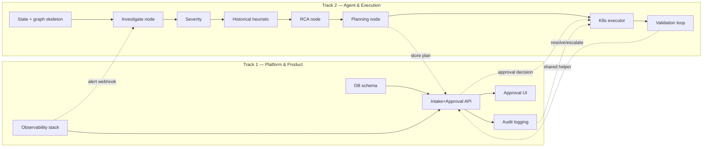

# Task Breakdown — 2-Person Team Execution Checklist

> Companion to [BUILD_PLAN.md](./BUILD_PLAN.md) and [SRS.md](./SRS.md). MVP-only checklist — see §7 for the Phase 2 backlog; don't start those items until everything below is checked off and working end-to-end.

---

## 0. Ground Rules

- Two tracks run **in parallel** after a short shared setup. Each track owns its files/folders exclusively to avoid merge conflicts.
- **Sync points** (§4) are mandatory short check-ins — this is where the two tracks' contracts (APIs, schemas, interfaces) get agreed/verified.
- Commit small and often, directly to `main` — this is a hackathon, not a place for long-lived feature branches.
- If a task is blocked by the other track's undone work, use a stub/mock and keep moving.

### Track Ownership

| Track | Person | Owns | Folders |
|---|---|---|---|
| **Track 1 — Platform & Product** | Person 1 | Observability stack, alerting, FastAPI intake/approval API, DB schema, audit logging, approval UI | `infra/`, `api/`, `ui/`, `db/` |
| **Track 2 — Agent & Execution** | Person 2 | LangGraph agent, Bedrock prompts, historical heuristic, K8s adapter, allow-list enforcement, validation loop | `agent/`, `tools/` |

---

## 1. Phase 0 — Shared Setup (Hour 0–2, do together)

- [ ] Confirm answers to SRS §10.B open questions (monitored app identity, Bedrock model ID) — or default to: generic instrumented FastAPI sample app, Claude 3.5 Sonnet on Bedrock.
- [ ] Create repo skeleton per [BUILD_PLAN.md §3](./BUILD_PLAN.md#3-proposed-repository-structure) (`agent/`, `tools/`, `api/`, `ui/`, `db/`, `infra/`, `tests/`, `scripts/`).
- [ ] Both: install Docker, `kind`/`minikube`, `kubectl`; Person 2 creates the `kind` cluster (`infra/kind-config.yaml`) and confirms `kubectl config current-context` points at it.
- [ ] Person 2: run an AWS Bedrock smoke test (single `InvokeModel` call) to confirm model access/region/credentials work.
- [ ] Person 1: bring up Postgres via Docker Compose; apply `db/schema.sql` v0 (empty `incidents`, `audit_log` tables per SRS §6).
- [ ] Agree the **Incident JSON contract** together (SRS §6.1) — write it into `agent/state.py` (Track 2) and `api/models.py` (Track 1) identically.
- [ ] Agree the **Tool Allow-list contract** (SRS §7) as a shared `tools/allowlist.yaml` both tracks read from.

**Definition of done:** both people can run `docker compose up` and get Postgres + an empty `kind` cluster; both have working Bedrock credentials; the Incident schema and allow-list file are committed and agreed.

---

## 2. Track 1 — Platform & Product (Person 1)

### 2.1 Observability Stack (Hour 2–8)
- [ ] `infra/docker-compose.observability.yaml`: Loki, Promtail, Prometheus, Alertmanager.
- [ ] Point Promtail/Prometheus scrape configs at the monitored app (confirm it exposes `/metrics` and structured logs; add minimal instrumentation if missing).
- [ ] Alert rules for: crash-loop pods, elevated error rate, latency SLO breach.
- [ ] Alertmanager webhook receiver config pointing at `api/routers/alerts.py` (stub with a 200 OK first so Alertmanager config can be verified independently).
- [ ] **Verify:** manually trigger a failure in the monitored app (bad image tag/crash) and confirm Alertmanager fires and POSTs to the stub webhook.

### 2.2 DB Schema & Migrations (Hour 2–5, before/parallel with 2.1)
- [ ] Finalize `db/schema.sql`: `incidents`, `audit_log` (SRS §6) with the enum status values from §6.1.
- [ ] Plain numbered `.sql` migration files run in order.
- [ ] `db/repository.py` — get/create/update-incident and append-audit-event functions; this is the *only* module allowed to run SQL (NFR-14). Routers and `log_audit_event` call these, never raw queries.
- [ ] `scripts/seed_historical_incidents.py` — writes 3–5 synthetic historical incidents.

### 2.3 FastAPI Intake + Approval API (Hour 5–14)
- [ ] `api/main.py` — app bootstrap, DB connection pool.
- [ ] `api/routers/alerts.py` — `POST /webhooks/alertmanager`: validate payload, create/correlate Incident row by Alertmanager's own `fingerprint` field, respond within 5s.
- [ ] `api/routers/incidents.py` — `GET /incidents`, `GET /incidents/{id}` (full detail incl. evidence/RCA/plan/history).
- [ ] `api/routers/approvals.py` — `POST /incidents/{id}/approve`, `POST /incidents/{id}/reject`; record actor, timestamp, comment; on reject → status `escalated`, no auto-retry.
- [ ] Wire the endpoint Track 2's graph calls to hand off a finished plan (`status=pending_approval`) and the endpoint Track 2's Executor/Validator call to report execution/validation results back.
- [ ] **Unblock with a stub:** until Track 2's graph exists, use a script that POSTs a fake RCA+plan payload to exercise the approval endpoints end-to-end.

### 2.4 Audit Logging (Hour 10–16)
- [ ] Shared `log_audit_event(incident_id, actor, action_type, payload)` helper that appends to `audit_log`, append-only, secrets redacted.
- [ ] Call it from every state transition, approval/rejection; expose `GET /incidents/{id}/audit`.

### 2.5 Approval UI (Hour 14–20)
- [ ] Minimal Streamlit UI: incident list (status, severity, service); incident detail (evidence, RCA rationale + confidence, historical matches, plan with risk levels, Approve/Reject with comment box).
- [ ] Audit timeline view for an incident.
- [ ] Wire UI to the live API once Track 2's pipeline produces real plans.

### 2.6 Demo Wiring & Polish (Hour 20–24+)
- [ ] End-to-end dry run of UC-1 (SRS §8) using the real stack.
- [ ] Fallback demo video recorded.
- [ ] README "how to run the demo" steps.

---

## 3. Track 2 — Agent & Execution (Person 2)

### 3.1 Agent State & Graph Skeleton (Hour 2–6)
- [ ] `agent/state.py` — Incident state schema (pydantic/TypedDict) matching the shared contract from Phase 0.
- [ ] `agent/graph.py` — LangGraph wiring: `Investigate → Severity → Historical → RCA → Plan`, each node a **stub/deterministic fake** first so the graph runs end-to-end immediately.
- [ ] `agent/llm_client.py` — thin Bedrock wrapper behind a common `analyze(...)` contract; on call failure/timeout/unparseable output, fall back to `agent/heuristics.py` instead of raising.
- [ ] `agent/heuristics.py` — deterministic rule-based RCA/plan fallback (e.g., recent deploy + latency → rollback; OOM signal → scale; crash-loop → restart) plus the historical similarity scorer (title/service/severity overlap).
- [ ] `scripts/run_agent_cli.py` — run one incident through the graph standalone (no FastAPI/UI needed) for fast iteration and as a demo-rehearsal safety net.

### 3.2 Investigate Node (Hour 6–9)
- [ ] `tools/base.py` — common adapter base (`name`, a live call method). Every tool below subclasses this.
- [ ] `tools/loki_tool.py` — LogQL query wrapper (FR-4).
- [ ] `tools/prometheus_tool.py` — PromQL query wrapper for error rate/latency/resource metrics (FR-4).
- [ ] Deployment/version metadata fetch (last image tag/commit) (FR-5).
- [ ] Wire real Bedrock call in the Investigate node to summarize gathered context (untrusted log content must be clearly quoted, never concatenated raw into an instruction-bearing prompt, per NFR-4).

### 3.3 Severity + Historical (Hour 9–12)
- [ ] Severity node: deterministic rule thresholds + LLM judgment blend, output includes rationale string (FR-7).
- [ ] Historical node: heuristic similarity scoring in `agent/heuristics.py` (title word overlap + same service + same severity, weighted) against stored past incidents (FR-8).
- [ ] Pass top-N similar historical incidents (prior root cause + outcome) into the RCA node as context.
- [ ] Coordinate with Person 1 (Sync Point 2) to run `seed_historical_incidents.py` so historical retrieval has data on day one.

### 3.4 RCA + Planning Nodes (Hour 12–16)
- [ ] RCA node: root cause summary, evidence references, confidence score 0–1 (FR-9); flag "low confidence" below threshold.
- [ ] Planning node: generate plan using **only** actions from `tools/allowlist.yaml`; each action has target, name, params, risk, expected effect (FR-10).
- [ ] Robust JSON extraction from LLM output (handle clean JSON, markdown-fenced blocks, and JSON surrounded by prose) before allow-list validation runs (FR-11).
- [ ] Reject/flag any out-of-catalog action before it ever reaches the API.
- [ ] Versioned prompt templates in `agent/prompts/`.

### 3.5 K8s Remediation (Hour 14–20)
- [ ] `tools/k8s_tool.py` — `restart_pod`, `rollback_deployment`, `scale_deployment` against the `kind` cluster via kubeconfig context (never inferred); dry-run mode for all (FR-17/18).
- [ ] Common `BaseRemediationTool` interface across adapters, extending `tools/base.py` (NFR-8).
- [ ] Re-validate every action/params against `tools/allowlist.yaml` immediately before running it — don't trust the Planning node's filtering alone (FR-15).
- [ ] Bounded retry w/ backoff (max 2) before escalating on tool-call failure (NFR-7).
- [ ] Execution logging (params, start/end time, result) into `audit_log` via Track 1's `log_audit_event` helper.

### 3.6 Validation Loop (Hour 18–21)
- [ ] Poll Prometheus + K8s readiness/liveness on a timer (default 15s interval / 3min window, configurable) (FR-19).
- [ ] Compare against pre-incident baseline captured during Investigate.
- [ ] On success → `resolved`; on failure at window end → `escalated`, no silent infinite retry (FR-20).
- [ ] On resolve, add the incident to the historical store used by §3.3 (FR-21).

### 3.7 Integration Testing (Hour 18–24+)
- [ ] Run UC-1 and UC-2 (SRS §8) against the real API/DB/UI built by Track 1.
- [ ] Fix any contract drift between agent output and API/UI expectations.

---

## 4. Sync Points (mandatory joint check-ins)

| Sync | Hour | Exit criteria |
|---|---|---|
| **S1** | 2 | Repo skeleton, Incident schema, allow-list file committed; K8s/Bedrock/Postgres all verified working |
| **S2** | 8–9 | Track 1's webhook stub + approval endpoints exist; Track 2's stub graph produces a fake plan matching the schema |
| **S3** | 14 | Track 2's graph calls Track 1's real API to store RCA/plan; Track 1's UI can display it |
| **S4** | 18 | A real approved plan executes a real `kubectl rollout undo` against `kind`, visible end-to-end in the UI |
| **S5** | 20–22 | UC-1 run live twice, timed; fallback video recorded |

---

## 5. Dependency Graph

---

## 6. Milestone Mapping (from BUILD_PLAN §6)

- [ ] **M0** (Hour 2) — Environment Ready → covered by Phase 0 + S1
- [ ] **M1** (Hour 8) — Alert Reaches Agent → Track 1 §2.1 verify step + Track 2 §3.1 stub graph, joined at S2
- [ ] **M2** (Hour 14) — Full AI Pipeline → Track 2 §3.2–3.4 complete, joined at S3
- [ ] **M3** (Hour 18) — First Real Remediation → Track 2 §3.5–3.6 complete, joined at S4
- [ ] **M4** (Hour 22) — Demo-Ready → S5 complete
- [ ] **M5** (Phase 2, only if time remains) → see §7 backlog

---

## 7. Phase 2 — Good to Have Backlog

Do not start these until the MVP loop (detection → investigation → RCA → plan → approval → K8s remediation → validation → audit) works end-to-end at least once.
- AWS remediation via LocalStack (`tools/aws_tool.py`: `restart_ecs_service`, `rollback_lambda_alias`, `adjust_asg_capacity`).
- GitHub remediation (`tools/github_tool.py`: `open_revert_pr`; manual merge only, no auto-merge action).
- OpenTelemetry trace collection (`tools/otel_tool.py`), layered into Investigate.
- pgvector embeddings + semantic similarity search, layered on top of the heuristic historical score.
- LangSmith/LangFuse tracing with `incident_id` correlation.
- RBAC roles (approver vs read-only) for the approval API.
- Pre-execution staleness re-check (compare live target state to a snapshot taken at approval time).
- A single `MOCK_MODE` flag that runs the whole pipeline offline.
- Auto-approval of low-risk actions (off by default), concurrent-incident hardening, Slack/email notifications.
